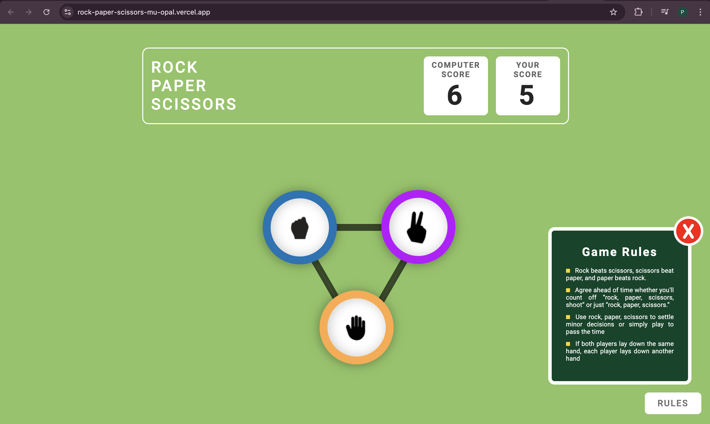
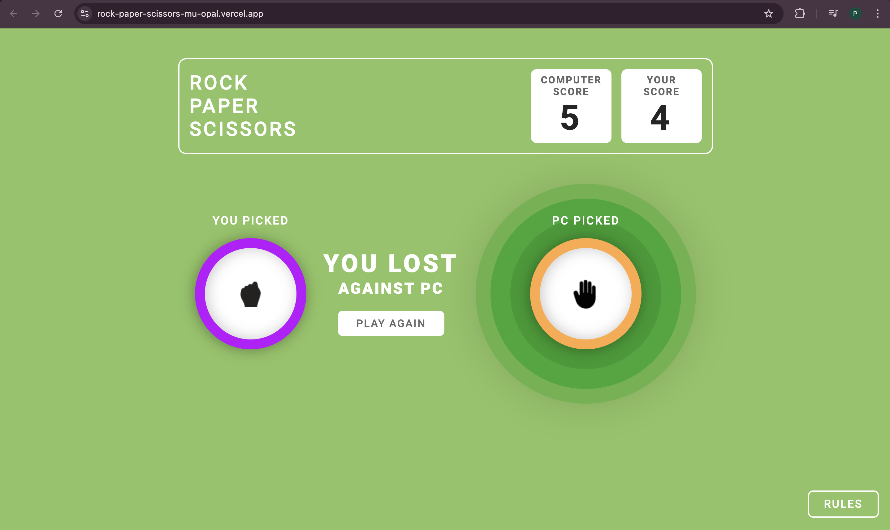
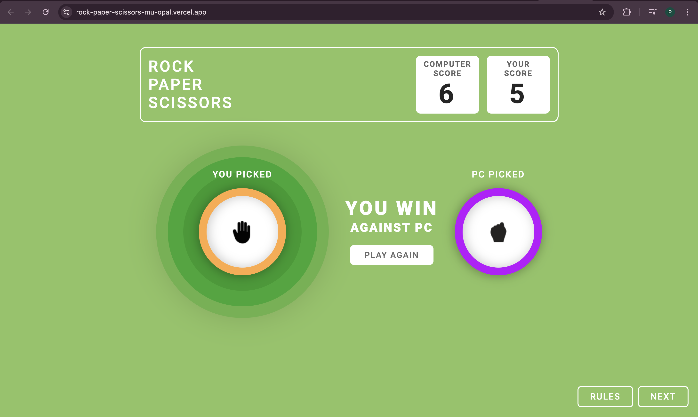
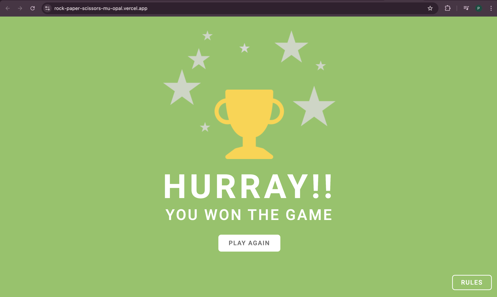

# Rock-Paper-Scissors Game 🎮

A fun and interactive web-based implementation of the classic Rock-Paper-Scissors game. This project features a visually appealing UI with smooth animations, responsive design, and an immersive user experience. Perfect for learning or teaching basic game logic and web development concepts.

## Features ✨

- **Responsive Design**: Fully responsive layout that works seamlessly on desktop and mobile devices.
- **Score Tracking**: Displays real-time scores for the player and computer.
- **Interactive Gameplay**: Buttons with hover animations for a better gaming experience.
- **Game Rules Modal**: An informative popup explaining the rules of the game.
- **Win Screen**: A celebratory screen for when the player wins the game.
- **Custom Styling**: Designed using CSS with vibrant colors, smooth transitions, and modern aesthetics.

## Demo 🌐

Check out the live demo [rock-paper-scissors-mu-opal.vercel.app]

## Getting Started 🚀

Follow these steps to set up the project locally:

### Prerequisites
- A web browser (Chrome, Firefox, Edge, etc.)
- Code editor (optional, e.g., VSCode)

### Installation
1. Clone the repository:
   ```bash
   git clone https://github.com/palakpatel01/rock-paper-scissors.git
   ```
2. Navigate to the project folder:
   ```bash
   cd rock-paper-scissors
   ```
3. Open the `index.html` file in your browser to start playing.

## How to Play? 🕹️

1. Choose one of the three actions: Rock, Paper, or Scissors.
2. The computer will make a random choice.
3. The result will be displayed on the screen:
   - Rock beats Scissors.
   - Scissors beats Paper.
   - Paper beats Rock.
4. The score will update based on the winner.
5. Aim to win the game and unlock the victory screen!

## Project Structure 📂

```plaintext
rock-paper-scissors/
├── index.html        # HTML structure of the game
├── style.css         # CSS for styling the game
├── script.js         # JavaScript for game logic (if applicable)
└── assets/           # Images, icons, and other assets
```

## Technologies Used 💻

- **HTML5**: For the structure of the game.
- **CSS3**: For styling, animations, and layout.
- **JavaScript (optional)**: To add interactivity and game logic.

## Screenshots 📸




 
_A celebratory win screen with animations!_


### Steps to Contribute:
1. Fork the repository.
2. Create a new branch: `git checkout -b feature-name`.
3. Make your changes and commit them: `git commit -m 'Add new feature'`.
4. Push to your branch: `git push origin feature-name`.
5. Open a pull request.


## Acknowledgements 🙌

- Inspired by the classic Rock-Paper-Scissors game.

